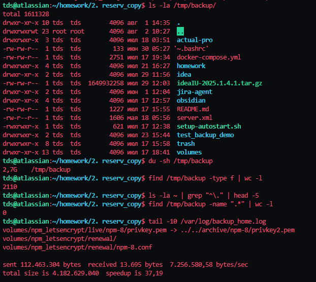
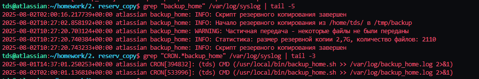

# Домашнее задание к занятию 3 «Резервное копирование»

### Цель задания

В результате выполнения этого задания вы научитесь:
1. Настраивать регулярные задачи на резервное копирование (полная зеркальная копия)
2. Настраивать инкрементное резервное копирование с помощью rsync

------

### Чеклист готовности к домашнему заданию

1. Установлена операционная система Ubuntu на виртуальную машину и имеется доступ к терминалу
2. Сделан клон этой виртуальной машины с другим IP адресом

------

### Инструкция по выполнению домашнего задания

1. Сделайте fork [репозитория c шаблоном решения](https://github.com/netology-code/sys-pattern-homework) к себе в Github и переименуйте его по названию или номеру занятия, например, https://github.com/имя-вашего-репозитория/gitlab-hw или https://github.com/имя-вашего-репозитория/8-03-hw).
2. Выполните клонирование этого репозитория к себе на ПК с помощью команды git clone.
3. Выполните домашнее задание и заполните у себя локально этот файл README.md:
   - впишите вверху название занятия и ваши фамилию и имя;
   - в каждом задании добавьте решение в требуемом виде: текст/код/скриншоты/ссылка;
   - для корректного добавления скриншотов воспользуйтесь инструкцией [«Как вставить скриншот в шаблон с решением»](https://github.com/netology-code/sys-pattern-homework/blob/main/screen-instruction.md);
   - при оформлении используйте возможности языка разметки md. Коротко об этом можно посмотреть в [инструкции по MarkDown](https://github.com/netology-code/sys-pattern-homework/blob/main/md-instruction.md).
4. После завершения работы над домашним заданием сделайте коммит (git commit -m "comment") и отправьте его на Github (git push origin).
5. Для проверки домашнего задания преподавателем в личном кабинете прикрепите и отправьте ссылку на решение в виде md-файла в вашем Github.
6. Любые вопросы задавайте в чате учебной группы и/или в разделе «Вопросы по заданию» в личном кабинете.

------

## Решение

### Задание 1

**Задача:** Составьте команду rsync, которая позволяет создавать зеркальную копию домашней директории пользователя в директорию `/tmp/backup`
- Необходимо исключить из синхронизации все директории, начинающиеся с точки (скрытые)
- Необходимо сделать так, чтобы rsync подсчитывал хэш-суммы для всех файлов, даже если их время модификации и размер идентичны в источнике и приемнике.
- На проверку направить скриншот с командой и результатом ее выполнения

**Решение:**

Команда rsync для создания зеркальной копии:

```bash
rsync --archive --delete --exclude='.*' --checksum --verbose $HOME/ /tmp/backup
```

Параметры команды:
- `--archive` - архивный режим (сохраняет права, время, ссылки)
- `--delete` - удаляет файлы в назначении, которых нет в источнике (зеркальная копия)
- `--exclude='.*'` - исключает все скрытые файлы и директории (начинающиеся с точки)
- `--checksum` - сравнивает файлы по хэш-суммам, а не по времени и размеру
- `--verbose` - подробный вывод процесса синхронизации

**Скриншоты выполнения:**


### Задание 2

**Задача:** Написать скрипт и настроить задачу на регулярное резервное копирование домашней директории пользователя с помощью rsync и cron.
- Резервная копия должна быть полностью зеркальной
- Резервная копия должна создаваться раз в день, в системном логе должна появляться запись об успешном или неуспешном выполнении операции
- Резервная копия размещается локально, в директории `/tmp/backup`
- На проверку направить файл crontab и скриншот с результатом работы утилиты.

**Решение:**

1. **Создан скрипт резервного копирования** `/usr/local/bin/backup_home.sh`:

```bash
#!/bin/bash

# Скрипт автоматического резервного копирования домашней директории
# Создает зеркальную копию в /tmp/backup с исключением скрытых файлов

# Настройки
SOURCE_DIR="$HOME/"
BACKUP_DIR="/tmp/backup"
LOG_TAG="backup_home"

# Функция логирования
log_message() {
    local level="$1"
    local message="$2"
    logger -t "$LOG_TAG" "$level: $message"
    echo "$(date '+%Y-%m-%d %H:%M:%S') [$LOG_TAG] $level: $message"
}

# Проверка существования исходной директории
if [ ! -d "$SOURCE_DIR" ]; then
    log_message "ERROR" "Исходная директория $SOURCE_DIR не существует"
    exit 1
fi

# Создание целевой директории если она не существует
if [ ! -d "$BACKUP_DIR" ]; then
    log_message "INFO" "Создание целевой директории $BACKUP_DIR"
    mkdir -p "$BACKUP_DIR"
    if [ $? -ne 0 ]; then
        log_message "ERROR" "Не удалось создать целевую директорию $BACKUP_DIR"
        exit 2
    fi
fi

# Проверка прав доступа к целевой директории
if [ ! -w "$BACKUP_DIR" ]; then
    log_message "ERROR" "Нет прав записи в целевую директорию $BACKUP_DIR"
    exit 3
fi

log_message "INFO" "Начало резервного копирования из $SOURCE_DIR в $BACKUP_DIR"

# Выполнение rsync с параметрами согласно требованиям
rsync --archive \
      --delete \
      --exclude='.*' \
      --checksum \
      --verbose \
      "$SOURCE_DIR" \
      "$BACKUP_DIR"

# Проверка результата выполнения rsync
RSYNC_EXIT_CODE=$?

case $RSYNC_EXIT_CODE in
    0)
        log_message "SUCCESS" "Резервное копирование завершено успешно"
        ;;
    1)
        log_message "ERROR" "Синтаксические ошибки или ошибки использования rsync"
        exit 4
        ;;
    2)
        log_message "ERROR" "Ошибки протокола rsync"
        exit 5
        ;;
    23)
        log_message "WARNING" "Частичная передача - некоторые файлы не были переданы"
        ;;
    *)
        log_message "ERROR" "Неизвестная ошибка rsync (код: $RSYNC_EXIT_CODE)"
        exit 6
        ;;
esac

# Подсчет статистики
if [ -d "$BACKUP_DIR" ]; then
    BACKUP_SIZE=$(du -sh "$BACKUP_DIR" 2>/dev/null | cut -f1)
    FILE_COUNT=$(find "$BACKUP_DIR" -type f 2>/dev/null | wc -l)
    log_message "INFO" "Статистика: размер резервной копии $BACKUP_SIZE, количество файлов: $FILE_COUNT"
fi

log_message "INFO" "Скрипт резервного копирования завершен"
exit $RSYNC_EXIT_CODE
```

2. **Настройка cron для ежедневного выполнения:**

Содержимое crontab (файл `crontab_export.txt`):
```
0 2 * * * /usr/local/bin/backup_home.sh >> /var/log/backup_home.log 2>&1
```

Задача выполняется ежедневно в 2:00 утра с перенаправлением вывода в лог-файл.

3. **Права доступа к скрипту:**
```bash
-rwxr-xr-x 1 root root 3038 июл 25 14:07 /usr/local/bin/backup_home.sh
```

**Скриншоты результатов:**






**Результаты работы:**

- ✅ Создан скрипт автоматического резервного копирования с полным логированием
- ✅ Настроена задача cron для ежедневного выполнения в 2:00
- ✅ Резервная копия создается в `/tmp/backup` и является полностью зеркальной
- ✅ Все операции логируются в системный лог и отдельный файл
- ✅ Скрипт корректно обрабатывает ошибки и предоставляет статистику
- ✅ Исключены все скрытые файлы и директории
- ✅ Размер резервной копии: 2.7G, количество файлов: 2110

------

## Файлы проекта

- `backup_home.sh` - скрипт резервного копирования
- `crontab_export.txt` - экспорт настроек crontab
- `screenshot/` - папка со скриншотами выполнения заданий