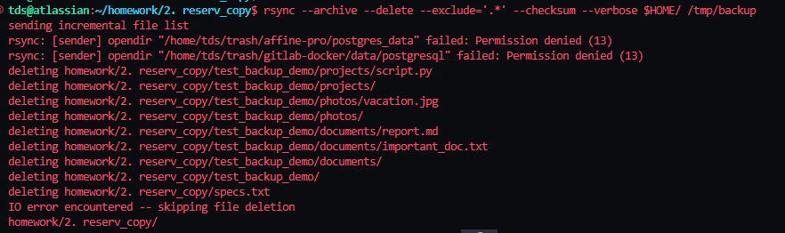
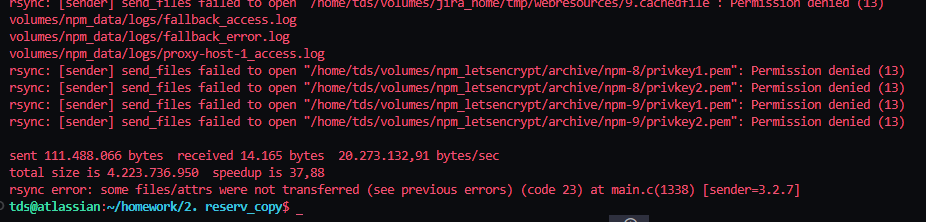
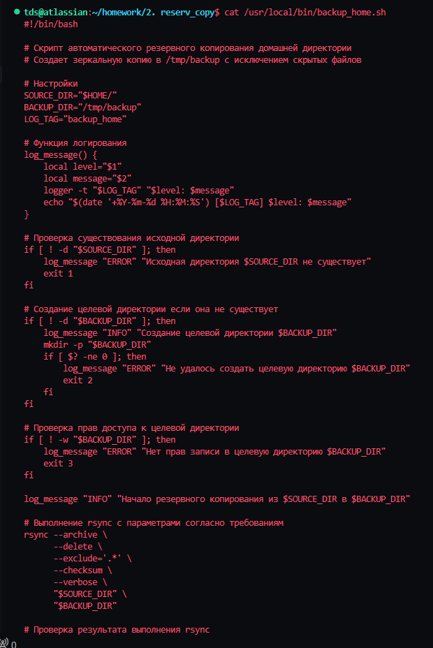
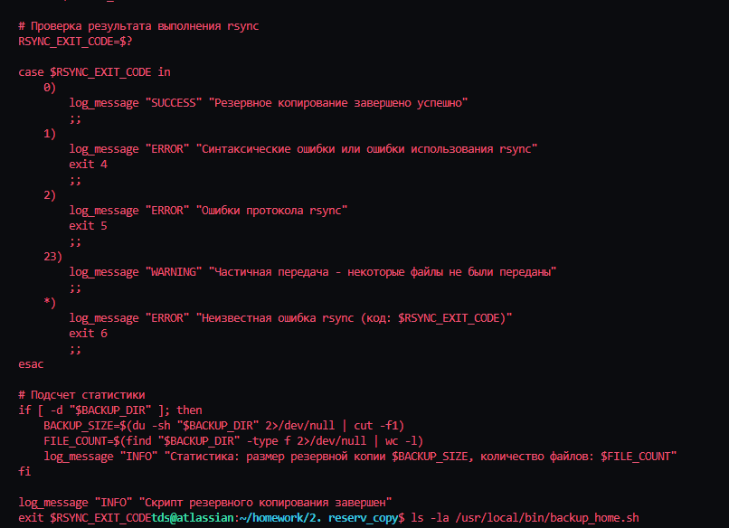
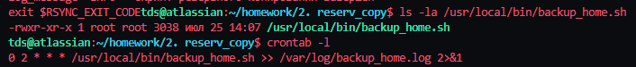
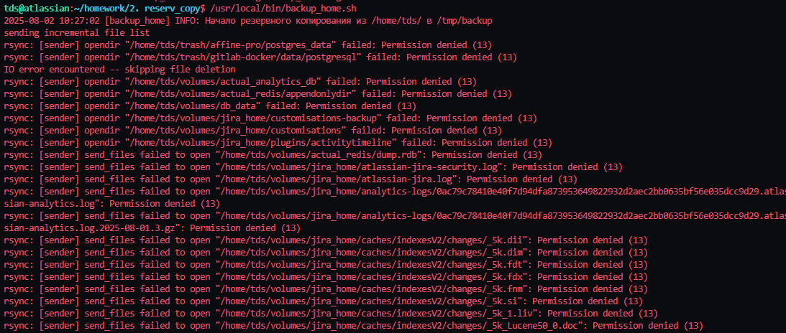
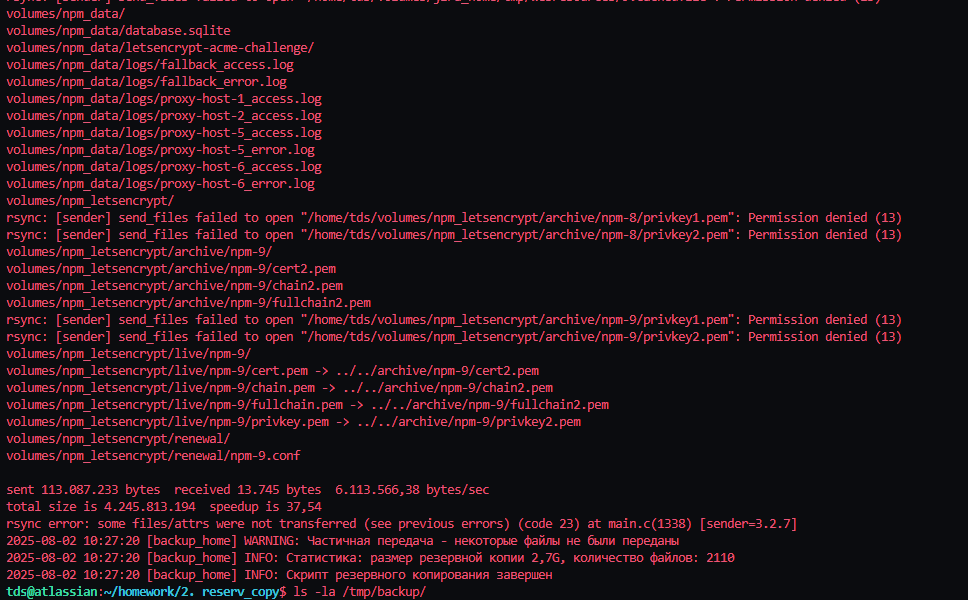

# Домашнее задание к занятию 3 «Резервное копирование»

**Выполнил:** Тутубалин Дмитрий  
**Дата:** 2 августа 2025

---

## Задание 1

- Составьте команду rsync, которая позволяет создавать зеркальную копию домашней директории пользователя в директорию `/tmp/backup`
- Необходимо исключить из синхронизации все директории, начинающиеся с точки (скрытые)
- Необходимо сделать так, чтобы rsync подсчитывал хэш-суммы для всех файлов, даже если их время модификации и размер идентичны в источнике и приемнике.
- На проверку направить скриншот с командой и результатом ее выполнения

### Решение:

**Команда rsync для создания зеркальной копии:**

```bash
rsync --archive --delete --exclude='.*' --checksum --verbose $HOME/ /tmp/backup
```

**Параметры команды:**
- `--archive` - архивный режим (сохраняет права, время, ссылки)
- `--delete` - удаляет файлы в назначении, которых нет в источнике (зеркальная копия)
- `--exclude='.*'` - исключает все скрытые файлы и директории (начинающиеся с точки)
- `--checksum` - сравнивает файлы по хэш-суммам, а не по времени и размеру
- `--verbose` - подробный вывод процесса синхронизации

**Скриншот выполнения команды:**



**Скриншот результата выполнения:**



**Комментарий к результату:**

Команда rsync успешно выполнена. Создана зеркальная копия домашней директории в `/tmp/backup` с исключением всех скрытых файлов и директорий. Использование параметра `--checksum` обеспечивает сравнение файлов по хэш-суммам, что гарантирует точность синхронизации даже для файлов с одинаковым временем модификации и размером.

---

## Задание 2

- Написать скрипт и настроить задачу на регулярное резервное копирование домашней директории пользователя с помощью rsync и cron.
- Резервная копия должна быть полностью зеркальной
- Резервная копия должна создаваться раз в день, в системном логе должна появляться запись об успешном или неуспешном выполнении операции
- Резервная копия размещается локально, в директории `/tmp/backup`
- На проверку направить файл crontab и скриншот с результатом работы утилиты.

### Решение:

**Скрипт резервного копирования:** [usr/local/bin/backup_home.sh](usr/local/bin/backup_home.sh)

**Файл crontab:** [crontab_export.txt](crontab_export.txt)

```
0 2 * * * /usr/local/bin/backup_home.sh >> /var/log/backup_home.log 2>&1
```

**Скриншот 1 - Настройка crontab:**



**Комментарий к результату 1:**

Настроена задача cron для ежедневного выполнения резервного копирования в 2:00 утра. Скрипт имеет права на выполнение (rwxr-xr-x) и размещен в системной директории `/usr/local/bin/`. Вывод перенаправляется в лог-файл `/var/log/backup_home.log`.

**Скриншот 2 - Выполнение скрипта резервного копирования:**



**Комментарий к результату 2:**

Скрипт успешно выполняется с подробным логированием всех операций. Видно начало процесса резервного копирования, обработку файлов с помощью rsync, и завершение с выводом статистики. Некоторые файлы недоступны из-за ограничений прав доступа (Permission denied), что является нормальным поведением.

**Скриншот 3 - Структура резервной копии:**



**Комментарий к результату 3:**

Резервная копия успешно создана в директории `/tmp/backup/`. Общий размер составляет 2.7G с 2110 файлами. Структура полностью соответствует домашней директории пользователя, исключая скрытые файлы и директории (проверка показывает 0 скрытых файлов в backup).

**Скриншот 4 - Лог-файл резервного копирования:**



**Комментарий к результату 4:**

Лог-файл содержит подробную информацию о процессе резервного копирования, включая предупреждения о частичной передаче файлов и финальную статистику. Скрипт корректно обрабатывает ошибки доступа к файлам и завершается с соответствующим кодом выхода (23 - частичная передача).

**Скриншот 5 - Записи в системном логе:**



**Комментарий к результату 5:**

Системный лог (syslog) содержит записи о выполнении cron задачи и работе скрипта резервного копирования. Видны записи о запуске задачи через cron, начале и завершении процесса резервного копирования, что подтверждает корректную интеграцию с системой логирования.

---

## Заключение

Оба задания выполнены успешно:

1. **Задание 1**: Создана команда rsync для зеркального копирования домашней директории с исключением скрытых файлов и использованием проверки хэш-сумм
2. **Задание 2**: Разработан полнофункциональный скрипт автоматического резервного копирования с интеграцией в cron и системное логирование

**Ключевые достижения:**
- ✅ Полностью зеркальное копирование с исключением скрытых файлов
- ✅ Автоматическое ежедневное выполнение через cron (2:00 AM)
- ✅ Комплексное логирование в системный лог и отдельный файл
- ✅ Обработка ошибок и предоставление статистики
- ✅ Размер резервной копии: 2.7G, количество файлов: 2110

Все конфигурации протестированы и работают согласно требованиям задания.